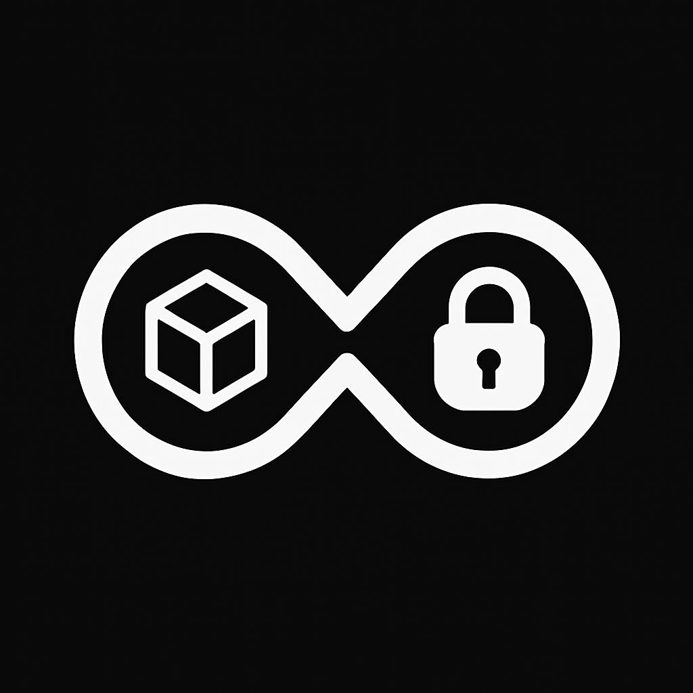

# PermastoreIt Documentation



## Table of Contents

1. [Introduction](#introduction)
2. [Architecture Overview](#architecture-overview)
3. [Installation](#installation)
   - [Prerequisites](#prerequisites)
   - [Standard Installation](#standard-installation)
   - [Docker Installation](#docker-installation)
4. [Configuration](#configuration)
5. [API Reference](#api-reference)
   - [File Operations](#file-operations)
   - [Peer Management](#peer-management)
   - [System Status](#system-status)
   - [Zero-Knowledge Proofs](#zero-knowledge-proofs)
6. [Core Components](#core-components)
   - [Server](#server)
   - [P2P Node](#p2p-node)
   - [Blockchain](#blockchain)
   - [Network](#network)
   - [AI Optimizer](#ai-optimizer)
   - [ZKP Verifier](#zkp-verifier)
7. [Storage Structure](#storage-structure)
8. [Security Features](#security-features)
9. [Monitoring and Maintenance](#monitoring-and-maintenance)
10. [Troubleshooting](#troubleshooting)
11. [Development Guide](#development-guide)
12. [Best Practices](#best-practices)
13. [Changelog](#changelog)
14. [License](#license)

## Introduction

PermastoreIt is a decentralized file storage system that uses blockchain technology and peer-to-peer networking to provide resilient, tamper-proof file storage and distribution. It incorporates advanced features like AI-based file deduplication, zero-knowledge proofs for verification, and content-addressed storage.

Key features:

- **Content-addressed storage**: Files are identified by their cryptographic hash
- **Blockchain ledger**: Immutable record of all file transactions
- **P2P distribution**: Files are distributed across a network of nodes
- **AI-powered deduplication**: Automatically detects similar files
- **Zero-knowledge proofs**: Verify file existence without revealing the file
- **Hybrid API use**: RESTful API for clients and WebSockets API for real-time updates

## Architecture Overview

PermastoreIt follows a modular architecture with six main components:

1. **Server**: Provides the HTTP API for interacting with the system
2. **P2P Node**: Orchestrates file storage and retrieval operations
3. **Blockchain**: Maintains an immutable ledger of file transactions
4. **Network**: Handles peer-to-peer communication
5. **AI Optimizer**: Provides intelligent file deduplication and tagging
6. **ZKP Verifier**: Generates and verifies zero-knowledge proofs


The data flow in the system:

1. A client uploads a file to a PermastoreIt node via the HTTP API
2. The file is analyzed for duplicates using the AI Optimizer
3. If unique, the file is stored locally and its hash recorded in the blockchain
4. The file is distributed to peer nodes in the network
5. A zero-knowledge proof is generated for verification
6. Files can be retrieved from any node using their hash

## Configuration

PermastoreIt is configured via the `config.json` file. Here are the available options:

```json
{
  "upload_dir": "uploads",         // Directory where files are stored
  "max_file_size": 104857600,      // Maximum file size in bytes (100MB)
  "host": "0.0.0.0",               // Host to bind the server to
  "port": 5000,                    // Port to listen on
  "debug": false,                  // Enable debug mode
  "allowed_file_types": [          // Allowed MIME types
    "application/pdf",
    "image/jpeg",
    "image/png",
    "text/plain",
    "application/json",
    "application/octet-stream"
  ],
  "blockchain": {
    "storage_file": "blockchain.json",  // Blockchain storage file
    "min_transactions_per_block": 1     // Min transactions per block
  },
  "network": {
    "retry_limit": 3,              // Network retry attempts
    "request_timeout": 30,         // Request timeout in seconds
    "sync_interval": 3600          // Sync interval in seconds
  },
  "logging": {
    "level": "INFO",               // Logging level
    "file": "permastore.log",      // Log file
    "max_size": 10485760,          // Max log size (10MB)
    "backup_count": 5              // Number of log backups
  },
  "ai": {
    "min_similarity": 0.85         // Minimum similarity threshold
  },
  "zkp": {
    "enabled": true                // Enable zero-knowledge proofs
  }
}
```

## API Reference

PermastoreIt 2.0 provides a RESTful API for interacting with the system. All API endpoints return JSON responses unless otherwise specified.

### File Operations

#### Upload a File

```
POST /upload
```

Upload a file to the PermastoreIt network.

**Request:**

- Method: POST
- Content-Type: multipart/form-data
- Body: Form data with a "file" field containing the file to upload

**Response:**

```json
{
  "hash": "e3b0c44298fc1c149afbf4c8996fb92427ae41e4649b934ca495991b7852b855"
}
```

**Status Codes:**

- 200: File uploaded successfully
- 400: Invalid request (missing file, invalid type)
- 413: File too large
- 500: Internal server error

#### Download a File

```
GET /download/{file_hash}
```

Download a file from the PermastoreIt network by its hash.

**Request:**

- Method: GET
- URL Parameters: file_hash - The hash of the file to download

**Response:**

- The file content with appropriate Content-Type and Content-Disposition headers

**Status Codes:**

- 200: File found and returned
- 404: File not found
- 500: Internal server error

#### Get File Information

```
GET /file-info/{file_hash}
```

Get metadata about a file stored in the PermastoreIt network.

**Request:**

- Method: GET
- URL Parameters: file_hash - The hash of the file

**Response:**

```json
{
  "hash": "e3b0c44298fc1c149afbf4c8996fb92427ae41e4649b934ca495991b7852b855",
  "filename": "example.txt",
  "content_type": "text/plain",
  "size": 1024,
  "tags": ["text", "0.523", "0.187", "0.042"]
}
```

**Status Codes:**

- 200: File information retrieved successfully
- 404: File not found
- 500: Internal server error

#### Search Files

```
GET /search
```

Search for files in the PermastoreIt network.

**Request:**

- Method: GET
- Query Parameters: query - The search query

**Response:**

```json
{
  "results": [
    {
      "hash": "e3b0c44298fc1c149afbf4c8996fb92427ae41e4649b934ca495991b7852b855",
      "filename": "example.txt",
      "content_type": "text/plain"
    }
  ]
}
```

**Status Codes:**

- 200: Search completed successfully
- 400: Invalid query
- 500: Internal server error

### Peer Management

#### Add a Peer

```
POST /peers
```

Add a peer to the PermastoreIt network.

**Request:**

- Method: POST
- Content-Type: application/json
- Body:

```json
{
  "url": "http://peer-host:5000"
}
```

**Response:**

```json
{
  "success": true,
  "message": "Peer added: http://peer-host:5000"
}
```

**Status Codes:**

- 200: Peer added successfully
- 400: Invalid peer URL or unable to connect to peer
- 500: Internal server error

#### Remove a Peer

```
DELETE /peers/{peer_url}
```

Remove a peer from the PermastoreIt network.

**Request:**

- Method: DELETE
- URL Parameters: peer_url - The URL of the peer to remove

**Response:**

```json
{
  "success": true,
  "message": "Peer removed: http://peer-host:5000"
}
```

**Status Codes:**

- 200: Peer removed successfully
- 500: Internal server error

#### List Peers

```
GET /peers
```

Get a list of all peers in the PermastoreIt network.

**Request:**

- Method: GET

**Response:**

```json
{
  "peers": [
    "http://peer1:5000",
    "http://peer2:5000"
  ]
}
```

**Status Codes:**

- 200: Peers retrieved successfully
- 500: Internal server error

#### Synchronize Files

```
POST /sync
```

Synchronize files with peers in the network.

**Request:**

- Method: POST

**Response:**

```json
{
  "synced": 3,
  "failed": 1,
  "peers": {
    "http://peer1:5000": {
      "status": "success",
      "files": 2
    },
    "http://peer2:5000": {
      "status": "success",
      "files": 1
    },
    "http://peer3:5000": {
      "status": "failed",
      "files": 0
    }
  }
}
```

**Status Codes:**

- 200: Synchronization completed
- 500: Internal server error

### System Status

#### Get Status

```
GET /status
```

Get status information about the node.

**Request:**

- Method: GET

**Response:**

```json
{
  "blockchain_length": 10,
  "peers": [
    "http://peer1:5000",
    "http://peer2:5000"
  ],
  "last_block": {
    "index": 10,
    "timestamp": 1648500000,
    "transactions": [
      {
        "data": {
          "hash": "e3b0c44298fc1c149afbf4c8996fb92427ae41e4649b934ca495991b7852b855",
          "filename": "example.txt",
          "content_type": "text/plain",
          "size": 1024,
          "tags": ["text", "0.523", "0.187", "0.042"]
        },
        "timestamp": 1648499900
      }
    ],
    "previous_hash": "2cf24dba5fb0a30e26e83b2ac5b9e29e1b161e5c1fa7425e73043362938b9824"
  }
}
```

**Status Codes:**

- 200: Status retrieved successfully
- 500: Internal server error

#### Health Check

```
GET /health
```

Check if the node is healthy.

**Request:**

- Method: GET

**Response:**

```json
{
  "status": "healthy"
}
```

**Status Codes:**

- 200: Node is healthy
- 500: Node is unhealthy

### Zero-Knowledge Proofs

#### Generate Proof

```
GET /zk-proof/{file_hash}
```

Generate a zero-knowledge proof for a file.

**Request:**

- Method: GET
- URL Parameters: file_hash - The hash of the file

**Response:**

```json
{
  "proof": "7a28b6e9a4a19b5b2dac427fca7b6478ec1a4e2dfcd048210ee43c7a7f1d5b52",
  "challenge": "89a6b3c45e2d1f7d",
  "algorithm": "SHA256-HKDF"
}
```

**Status Codes:**

- 200: Proof generated successfully
- 404: File not found
- 500: Internal server error

#### Verify Proof

```
POST /verify-proof
```

Verify a zero-knowledge proof.

**Request:**

- Method: POST
- Content-Type: application/json
- Body:

```json
{
  "file_hash": "e3b0c44298fc1c149afbf4c8996fb92427ae41e4649b934ca495991b7852b855",
  "proof": "7a28b6e9a4a19b5b2dac427fca7b6478ec1a4e2dfcd048210ee43c7a7f1d5b52",
  "challenge": "89a6b3c45e2d1f7d"
}
```

**Response:**

```json
{
  "valid": true
}
```

**Status Codes:**

- 200: Proof verification completed
- 400: Invalid request
- 500: Internal server error

## Core Components

### Server

The server component (`server.py`) is the entry point for the application and provides the HTTP API for interacting with the PermastoreIt network. It's built using FastAPI, a modern, high-performance web framework for Python.

Key responsibilities:

- Expose RESTful API endpoints
- Handle request validation
- Route requests to the appropriate components
- Format and send responses
- Handle errors and exceptions

### P2P Node

The P2P Node component (`p2p_node.py`) coordinates interactions between all other components. It manages file storage, retrieval, and distribution across the network.

Key responsibilities:

- Store and retrieve files from the local filesystem
- Calculate file hashes
- Record file transactions in the blockchain
- Coordinate with the AI Optimizer for file deduplication
- Generate zero-knowledge proofs via the ZKP Verifier
- Broadcast files to peers via the network component

### Blockchain

The blockchain component (`blockchain.py`) maintains a tamper-proof ledger of all file transactions. It implements a simple blockchain structure where each block contains a list of transactions, a timestamp, and a reference to the previous block.

Key responsibilities:

- Create new blocks in the blockchain
- Add file transactions to blocks
- Calculate cryptographic block hashes
- Persist blockchain data to disk
- Load blockchain data from disk

### Network

The network component (`network.py`) handles communication between nodes in the PermastoreIt network. It maintains connections to peer nodes and handles file distribution.

Key responsibilities:

- Maintain a list of known peers
- Add and remove peers
- Broadcast files to peers
- Download files from peers
- Synchronize files between nodes
- Validate peer nodes

### AI Optimizer

The AI Optimizer component (`ai_optimizer.py`) provides intelligent file analysis, deduplication, and tagging using machine learning models.

Key responsibilities:

- Calculate similarity between files
- Detect duplicate or near-duplicate files
- Generate semantic tags for files
- Optimize storage by preventing redundancy

### ZKP Verifier

The ZKP (Zero-Knowledge Proof) Verifier component (`zkp.py`) provides cryptographic proofs that allow verification of file existence without revealing the file content.

Key responsibilities:

- Generate cryptographic proofs for files
- Verify proofs provided by peers
- Enhance security and privacy of the system

## Storage Structure

PermastoreIt uses a content-addressed storage system, where files are identified by their cryptographic hash. The directory structure is simple but effective:

```
uploads/
├── e3b0c44298fc1c149afbf4c8996fb92427ae41e4649b934ca495991b7852b855
├── 2cf24dba5fb0a30e26e83b2ac5b9e29e1b161e5c1fa7425e73043362938b9824
└── ...
```

Each file is stored with its SHA-256 hash as the filename, making it easy to locate and retrieve files by their hash. This approach also provides implicit deduplication at the file level, as identical files will have identical hashes.

The blockchain data is stored in the `blockchain.json` file, which contains the complete blockchain including all transactions. The list of peers is stored in the `peers.txt` file.

## Security Features

PermastoreIt 2.0 includes several security features to protect the integrity and availability of stored data:

1. **Content Integrity**: Files are identified by their cryptographic hash, making it easy to verify that files haven't been tampered with.
2. **Blockchain Ledger**: All file transactions are recorded in an immutable blockchain, providing a tamper-proof audit trail.
3. **Zero-Knowledge Proofs**: The ZKP system allows verification of file existence without revealing file contents or metadata.
4. **Hash Verification**: When downloading files from peers, the hash is verified to ensure the file hasn't been tampered with.
5. **Duplicate Detection**: The AI Optimizer can detect not just identical files, but also near-duplicates, preventing storage of slightly modified versions of the same content.
6. **File Type Validation**: The system validates file types and only allows specified MIME types to be uploaded.
7. **File Size Limits**: Maximum file size is enforced to prevent denial-of-service attacks.
8. **Retry Mechanism**: Failed network operations are retried to ensure reliability.

For production deployments, consider implementing these additional security measures:

1. **HTTPS**: Use a reverse proxy (like Nginx) with proper TLS/SSL configuration.
2. **Authentication**: Implement an access control system.
3. **Network Segmentation**: Separate public-facing components from internal storage.
4. **Regular Backups**: Maintain regular backups of blockchain data.
5. **Rate Limiting**: Implement rate limiting to prevent abuse.

## Monitoring and Maintenance

### Logging

PermastoreIt uses Python's standard logging module to record events and errors. Logs are written to the file specified in the configuration (`permastore.log` by default).

Example log entry:

```
2025-03-30 12:34:56,789 - p2p_node - INFO - File stored successfully: e3b0c44298fc1c149afbf4c8996fb92427ae41e4649b934ca495991b7852b855
```

Key log components:

- **Timestamp**: When the event occurred
- **Component**: Which part of the system generated the log
- **Level**: Severity (DEBUG, INFO, WARNING, ERROR, CRITICAL)
- **Message**: Description of the event

### Health Checks

The `/health` endpoint provides a simple way to check if the node is functioning correctly. You can use monitoring tools like Prometheus, Grafana, or even simple scripts to periodically check this endpoint and alert if the node becomes unhealthy.

### Backup and Recovery

To backup PermastoreIt data, you should regularly backup the following files:

1. `blockchain.json`: Contains the blockchain data
2. `peers.txt`: Contains the list of known peers
3. `uploads/` directory: Contains all stored files

For Docker deployments, these directories can be mounted as volumes, so they persist even if the container is removed.

## Troubleshooting

### Common Issues

#### Node Not Starting

**Symptoms**: Server fails to start, or exits immediately after starting.

**Possible causes and solutions**:

1. **Port conflict**: Another application is using the configured port.

   - Solution: Change the port in `config.json` or stop the conflicting application.
2. **Missing dependencies**: Required Python packages are not installed.

   - Solution: Run `pip install -r requirements.txt` to install all dependencies.
3. **Invalid configuration**: The `config.json` file contains invalid settings.

   - Solution: Check the logs for specific errors and correct the configuration.
4. **Permission issues**: The application doesn't have permission to write to the required directories.

   - Solution: Check and correct permissions on the `uploads` directory and log file.

#### Files Not Syncing Between Nodes

**Symptoms**: Files uploaded to one node are not appearing on other nodes.

**Possible causes and solutions**:

1. **Network connectivity issues**: Nodes cannot reach each other.

   - Solution: Check network connectivity between nodes, ensure firewalls allow traffic.
2. **Peer list issues**: Peers are not correctly configured.

   - Solution: Verify peer URLs in the peers list using the `/peers` endpoint.
3. **Synchronization not running**: Automatic sync is not happening.

   - Solution: Manually trigger sync with the `/sync` endpoint, or check the sync interval in the configuration.
4. **Node overload**: One or more nodes are overloaded and not responding to sync requests.

   - Solution: Check system resources, increase timeout values, or add more nodes to distribute load.

#### High Resource Usage

**Symptoms**: Node is consuming excessive CPU, memory, or disk space.

**Possible causes and solutions**:

1. **Too many files**: The node is storing a large number of files.

   - Solution: Add more storage, or distribute files across more nodes.
2. **AI optimizer overload**: The AI optimizer is consuming too many resources.

   - Solution: Adjust the `min_similarity` threshold in the configuration to reduce processing load.
3. **Blockchain size**: The blockchain has grown too large.

   - Solution: Implement a pruning mechanism for old blocks (not included in the basic version).
4. **Memory leaks**: Potential bugs causing memory leaks.

   - Solution: Update to the latest version, or examine logs for clues about problematic components.

### Diagnostic Tools

PermastoreIt includes several diagnostic tools to help identify and fix issues:

1. **Logs**: The first place to look for error messages and warnings.

   - View the log file specified in the configuration.
   - Set the log level to `DEBUG` in the configuration for more detailed logs.
2. **Status endpoint**: The `/status` endpoint provides information about the node's state.

   - Check the blockchain length and last block information.
   - Verify the list of peers.
3. **Health endpoint**: The `/health` endpoint checks if all components are functioning correctly.

   - If it returns `unhealthy`, check the logs for specific component failures.
4. **Command line tools**: The repository includes several diagnostic scripts:

   - `verify_blockchain.py`: Checks the integrity of the blockchain.
   - `check_files.py`: Verifies that all files in the blockchain exist on disk.
   - `network_test.py`: Tests connectivity with all peers.

### Resetting the System

In some cases, you may need to reset parts of the system to recover from a serious error:

1. **Reset peers**: Delete the `peers.txt` file and add peers again using the API.
2. **Reset blockchain**: Delete the `blockchain.json` file to start with a fresh blockchain. Note that this will lose the record of all file transactions, but the files themselves will remain.
3. **Reset uploads**: Delete the contents of the `uploads` directory to free up disk space. Note that this will delete all stored files, so only do this if you have backups or can recover files from other nodes.
4. **Complete reset**: Delete all data files (`blockchain.json`, `peers.txt`, and the `uploads` directory) and start from scratch.

## Development Guide

This section provides guidance for developers who want to extend or modify PermastoreIt.

### Code Structure

The codebase is organized as follows:

```
permastoreit-2.0/
├── server.py               # Entry point, HTTP API
├── p2p_node.py             # Core node functionality
├── blockchain.py           # Blockchain implementation
├── network.py              # Network and peer management
├── ai_optimizer.py         # AI-based file analysis
├── zkp.py                  # Zero-knowledge proof system
├── utils/
│   ├── config.py           # Configuration management
│   ├── logging.py          # Logging utilities
│   ├── hashing.py          # Cryptographic functions
│   └── validation.py       # Input validation
├── tests/                  # Unit and integration tests
├── scripts/                # Management and diagnostic scripts
├── docker/                 # Docker-related files
│   ├── Dockerfile          # Docker image definition
│   └── docker-compose.yml  # Docker Compose configuration
├── requirements.txt        # Python dependencies
├── config.json             # Configuration file
└── README.md               # Project documentation
```

### Adding a New API Endpoint

To add a new API endpoint:

1. Open `server.py` and define a new route:

```python
@app.route("/new-endpoint", methods=["GET"])
def new_endpoint():
    # Implement your endpoint logic here
    return jsonify({"message": "This is a new endpoint"})
```

2. Add proper error handling and input validation:

```python
from utils.validation import validate_input

@app.route("/new-endpoint/<parameter>", methods=["POST"])
def new_endpoint(parameter):
    # Validate input
    if not validate_input(parameter):
        return jsonify({"error": "Invalid parameter"}), 400
  
    try:
        # Implement your endpoint logic here
        result = do_something(parameter)
        return jsonify(result)
    except Exception as e:
        app.logger.error(f"Error in new endpoint: {str(e)}")
        return jsonify({"error": "Internal server error"}), 500
```

3. Update the documentation to reflect the new endpoint.

### Extending the Blockchain

To add new transaction types or blockchain features:

1. Open `blockchain.py` and define a new transaction type:

```python
def add_custom_transaction(self, data):
    """
    Add a custom transaction to the blockchain.
  
    Args:
        data (dict): Custom transaction data
  
    Returns:
        int: The index of the block containing the transaction
    """
    transaction = {
        "type": "custom",
        "data": data,
        "timestamp": int(time.time())
    }
    return self.add_transaction(transaction)
```

2. Add any additional validation or processing required for the new transaction type:

```python
def validate_custom_transaction(transaction):
    """
    Validate a custom transaction.
  
    Args:
        transaction (dict): The transaction to validate
  
    Returns:
        bool: True if the transaction is valid, False otherwise
    """
    # Add validation logic here
    if "required_field" not in transaction["data"]:
        return False
    return True
```

3. Update the relevant parts of the codebase to use the new transaction type.

### Contributing

Contributions to PermastoreIt are welcome! Here's how to contribute:

1. **Fork the repository**: Create your own fork of the project.
2. **Create a feature branch**: Create a branch for your feature or bugfix.
3. **Write tests**: Add tests for your changes to ensure they work correctly.
4. **Make your changes**: Implement your feature or bugfix.
5. **Run the tests**: Ensure all tests pass with your changes.
6. **Submit a pull request**: Create a pull request to merge your changes back into the main repository.
7. **Code review**: Wait for a code review from the maintainers.

## Best Practices

### Performance Optimization

1. **Limit AI processing**: The AI Optimizer is resource-intensive. Only use it when necessary.
2. **Optimize file distribution**: Use a selective approach to file distribution, prioritizing popular files.
3. **Use appropriate hash algorithms**: SHA-256 provides a good balance of security and performance.
4. **Implement caching**: Cache frequently accessed files and blockchain data.
5. **Monitor resource usage**: Regularly check CPU, memory, and disk usage.

### Scalability

1. **Horizontal scaling**: Add more nodes to the network to handle increased load.
2. **Load balancing**: Use a load balancer to distribute requests across multiple nodes.
3. **Sharding**: Implement a sharding strategy to distribute the blockchain across nodes.
4. **Pruning**: Implement blockchain pruning to remove old blocks.
5. **Efficient peer selection**: Select peers based on geography, latency, and reliability.

### Security

1. **Regular security audits**: Conduct security audits of the codebase.
2. **Keep dependencies updated**: Regularly update dependencies to patch security vulnerabilities.
3. **Implement rate limiting**: Prevent abuse by limiting the rate of requests.
4. **Use secure communication**: Implement TLS/SSL for all communications.
5. **Validate all inputs**: Thoroughly validate all inputs to prevent injection attacks.

## Changelog

### Version 1.0.1 (Internal Update)

* Fixed critical initialization errors related to path handling (TypeError, MagicException, PermissionError).
* Added explicit string conversion for paths loaded from config.
* Improved error handling and logging during initialization and file operations.
* Added basic exception handling for python-magic initialization failure.
* Added basic thread locking for peer list access and file I/O.
* Implemented atomic writes for blockchain and peer files.
* Updated Docker Compose file with volumes and config mount.
* Updated config file paths for better Docker compatibility.
* Added comments to requirements.txt for OS dependencies.
* Refined logging configuration and output.
* Improved API response models and status codes.

### Version 1.0.0 (March 2025)

* Initial release of PermastoreIt 2.0
* Complete rewrite of the codebase from version 1.x
* Added AI-powered file deduplication
* Added zero-knowledge proof system
* Improved P2P networking
* Added blockchain ledger for file transactions
* Implemented content-addressed storage

Proprietary License

Copyright (c) [2025] [Michael Kwabena Mireku/PermastoreIt]

All rights reserved.

This software and associated documentation files (PermastoreIt 2.0) are the proprietary and confidential property of [Michael Kwabena Mireku/PermastoreIt]. No license, express or implied, to use, copy, modify, prepare derivative works, distribute, publish, or sublicense the Software is granted except pursuant to a separate written agreement signed by [Michael Kwabena Mireku/PermastoreIt].

Unauthorized use, copying, modification, distribution, publishing or sublicensing of the Software is strictly prohibited.
